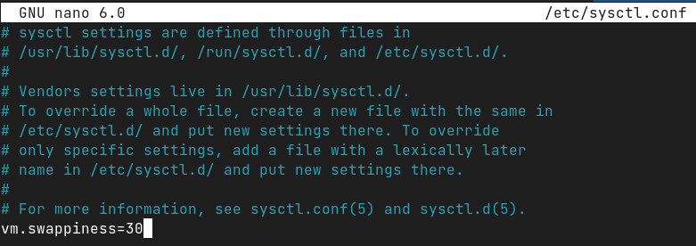

### Задание 1
Что происходит с оперативной памятью во время перехода ПК в:

1. сон (suspend)
_suspend - режим, при котором приложения не закрываются, а компьютер снижает потребление энергии до минимального уровня. Если в режиме сна батарея ноутбука закончится (или компьютер отключить от сети), то данные в RAM потеряются_
2. гибернацию (hibernate)
_hibernate - режим, при котором делается "слепок" всех процессов и данных на жеский диск компьютера, затем питание отключается полностью. При выходе из этого режима информация с жесткого диска обратно "закачивается" в RAM и пользователь может продолжать работу с того места, где остановился ранее._

### Задание 2
Команда `vmstat` - доступна при установке пакета **_sysstat_**
- **so** - показывает количество памяти перекидываемое на диск
- **si** - показывает количество памяти перекидываемое с диска

### Задание 3
1. `arch` или `uname -m`
2. `cat /proc/cpuinfo | grep 'model name'`
3. `cat /proc/meminfo | grep -i inactive`

### Задание 4

1. 

2. 
- `btrfs subvolume create /home/alex/swap`
- `cd /home/alex/swap`
- `truncate -s 0 ./swapfile`
- `chattr +C ./swapfile`
- `btrfs property set ./swapfile compression none`
- `sudo dd if=/dev/zero of=/home/alex/swap/swapfile bs=1M count=1096`
- `sudo mkswap /home/alex/swap/swapfile && sudo chmod 600 /home/alex/swap/swapfile && sudo swapon /home/alex/swap/swapfile`

3. 
Настройка автозагрузки свапа при старте системы	`echo '/swapfile none swap sw 0 0' | sudo tee -a /etc/fstab`

4. 

5. 

6. 
- Открываем файл /etc/sysctl.conf, вносим в конец `vm.swappiness=30`. 

- Перезагружаемся
