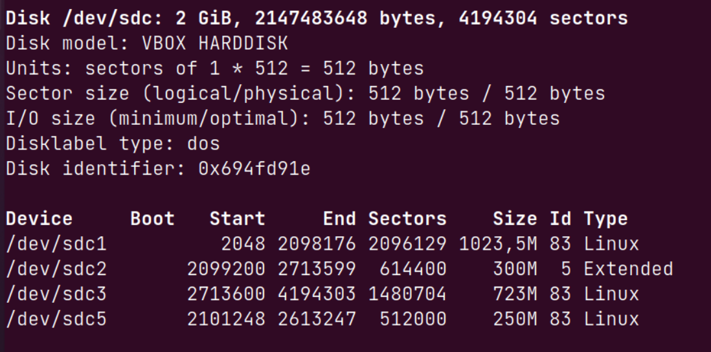
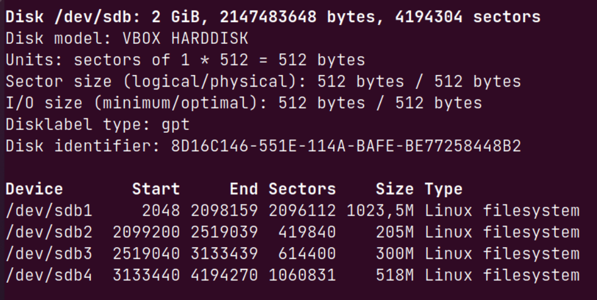

### Задание 1

Какие виды RAID увеличивают производительность дисковой системы?

*RAID 0 увеличивает производительность системы т.к. данные записываются с чередованием данных блоками (но если один диск будет поврежден, данные будут утеряны. RAID 10 так же является высокопроизводительным, но массив должен состоять из четного количества дисков (минимум 4), чтобы по два диска объединились в отказоустойчивые RAID 1, а получившиеся два RAID 1 уже были объединены в высокопроизводительный RAID 0. Но стоит это дорого.*

### Задание 2

Влияет ли количество операций ввода-вывода на параментр `load average`?

*Да, влияет. Т.к. в линуксе команда `load average` выводит не только значения загрузки **процессора** но всей системы: количество всех потоков (исполняемых и ожидающих).*

### Задание 3

*Подключите к виртуальной машине 2 новых диска.*

*1)На первом диске создайте таблицу разделов MBR, Создайте 4 раздела: первый раздел на 50% диска, остальные любого размера на ваше усмотрение. Хотя бы один из разделов должен быть логическим.*

*2)На втором диске создайте таблицу разделов GPT. Создайте 4 раздела: первый раздел на 50% диска, остальные любого размера на ваше усмотрение.*

*
