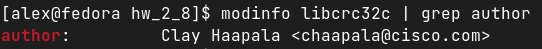

### Задание 1

При каких событиях выполнение процесса переходит в режим ядра?

*Существуют всего 3 события, при которых запускается режим ядра:*
- *аппаратное прерывание*
- *системные вызовы*
- *исключения (обращение к несуществующей области памяти, деление на 0 и т.п)*

### Задание 2

Найдите имя автора модуля libcrc32c.

### Задание 3

Используя утилиту `strace` выясните какой системный вызов использует команда `cd`.

*Ответ: `chdir`*
