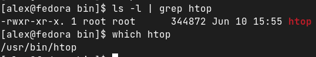
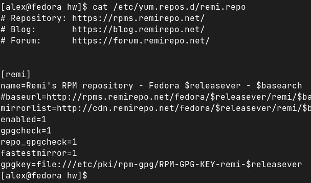
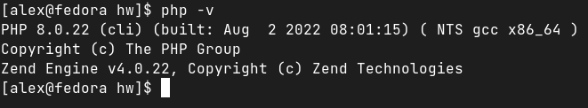
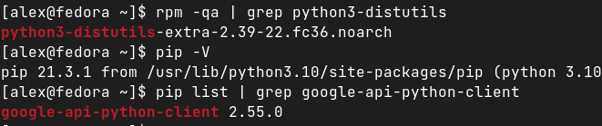

### Задание 1

Опишите плюсы работы с пакетным менеджером и репозиторием.
Как вы считаете, в чем основные достоинства такой организации ПО?
Есть ли минусы?

*Ответ*:
*1. Не нужно искать по всему интернету, где скачать программу - ищем в гугле, в каком репозитории она расположена, и через терминал командой закачиваем*
*2. Почти всегда с программой необходимо устанавливать зависимости - это легко решает пакетный менеджер, который эти зависимости видит и устанавливает все необходимое без вмешательства человека.*
*3. Это безопасно и надежно. Репозитории поддерживают безопасность и устойчивость релизов силами мейнтейнеров.*
*4. Удаление одной командой. Т.к. в пакетном менеджере есть записи о зависимостях и всех местах хранения "следов" на машине, то (в отличие от Windows удаляется программа полностью.*
*5. Обновления программ. Windows обновляет только саму себя. Обновление программ под винду - область практически недостижимой фантастики. Пакетные менеджеры проверяют наличие обновлений установленных программ по расписанию (примерно раз в час).*

*Минусы тоже есть: в официальных репозиториях может страдать скорость доставки новых фич (т.е. релиза новых версий), т.к. тратится огромное количество времени на проверку стабильности билда, зависимостей и т.д. Т.е. программисты заинетерсованы в скорейшей доставке фич, репозитории задерживают доставку в эксплуатацию из-за проверок.*

### Задание 2

При подключении стороннего репозитория надо выполнить ряд определенных действий.

Каких? *Подключить этот репозиторий в файле `/etc/apt/sources.list`*

В чем опасность такого способа распространения ПО? *Помимо очевидных сомнений по поводу качества проверки сборок еще есть проблема в перехвате траффика (MITM атака).*

Как это решается? *Не устанавливать программы из незнакомых репозиториев. Если доверяет репозиторию, то проблема MITM решается через GPG ключ, который скачивается и имортируется. Открытая часть ключа сравнивается с закрытой (которая есть только владельца репозитория) и, если кто-то посередине встал и передает нам подмененный ключ, мы об этом узнаем по несовпадению открытой части ключа.*

### Задание 3

Запустите свою виртуальную машину.
Найдите в репозиториях и установите одной командой пакет `htop`.

Какие зависимости требует `htop`?
Ответ приведите в виде текста команды, которой вы это выполнили, а также приложите скриншот места расположения исполняемых файлов установленного ПО.

*Ответ для Debian: командой* `sudo apt install htop` *- устанавливаем пакет. Командой* `sudo apt depends htop` *проверяем зависимости.*
*А так выглядит место расположение исполняемых файлов для Fedora:*

# Задание 4

1. Подключите репозиторий PHP и установите PHP 8.0.
Приложите скриншот содержимого файла, в котором записан адрес репозитория.

2. При помощи команды php -v убедитесь, что бы поставлена корректная версия PHP.
Приложите к ответу скриншот версии.

### Задание 5

Ваш коллега-программист просит вас установить модуль google-api-python-client на сервер, который необходим для программы, работающей с Google API.
Установите данный пакет при помощи менеджера пакетов pip.
Примечение №1: для установки может быть необходим пакет python-distutils, проверьте его наличие в системе.
Примечение №2: не забудьте выдать права на исполение скачанному файлу. Возможно, будет ошибка при установки при помощи Python версии 2, в таком случае воспользйтесь командой python3.
Приложите скриншоты с установленным пакетом python-distutils, с версией Pip и установленными модулями (должны быть видимы)

*Ответ:*

