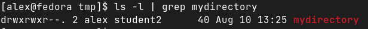

### Задание 1.

Создайте пользователя student1 с оболочкой bash, входящего в группу student1.
*Ответ: создаем командой* `sudo useradd -s /bin/bash -U student1`
Создайте пользователя student2, входящего в группу student2.
*Ответ: создаем командой* `sudo useradd -U student2`
Приведите ответ в виде снимков экрана.
*Проверяем*

### Задание 2.

Создайте в общем каталоге (например, /tmp) директорию и назначьте для неё полный доступ со стороны группы student2 и доступ на чтение всем остальным
Приведите ответ в виде снимков экрана.

### Задание 3.

Какой режим доступа установлен для файлов /etc/passwd и /etc/shadow?
Объясните, зачем понадобилось именно два файла?
Приведите ответ в свободной форме.

*Ответ:*

_/еtc/passwd_ *содержит данные по юзерам. Под рутом можно читать, записывать. В остальных случаях - только читать.*
_/etc/shadow_ *содержит зашифрованные пароли юзеров. Разрешений у этого файла нет, совсем.*
*Файл passwd используется различными утилитами для определения пользователя. А вот shadow трогать не нужно, потому что шифрование выполняется на стороне системы и исправлять/просматривать в этом файле совершенно нечего.*

### Задание 4.

Удалите группу student2, а пользователя student2 добавьте в группу student1.
Приведите ответ в виде снимков экрана.

1. `sudo usermod -g student1 student1`
2. `sudo usermod -g student1 student2`
3. `sudo groupdel student2`

