Задание 1.

Выполните проверку системы при помощи команды top.
Выведите сортировку процессов по:
- памяти;
- времени работы;
- номеру;
- уровню потребления ресурсов.
Приведите ответ в виде снимков экрана.

*Ответ:*

*Командой* `top -O` *выводятся все доступные поля для сортировки.*
*Командой* `top -o [поле для сортировки]` *осуществляется вывод с сортировкой по указанному полю.*

1. 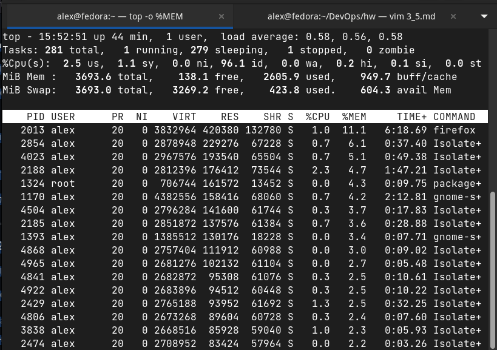

2. 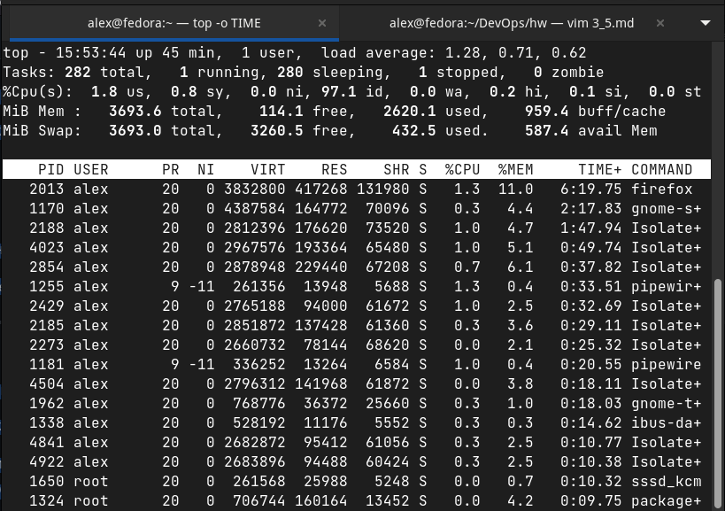

3. 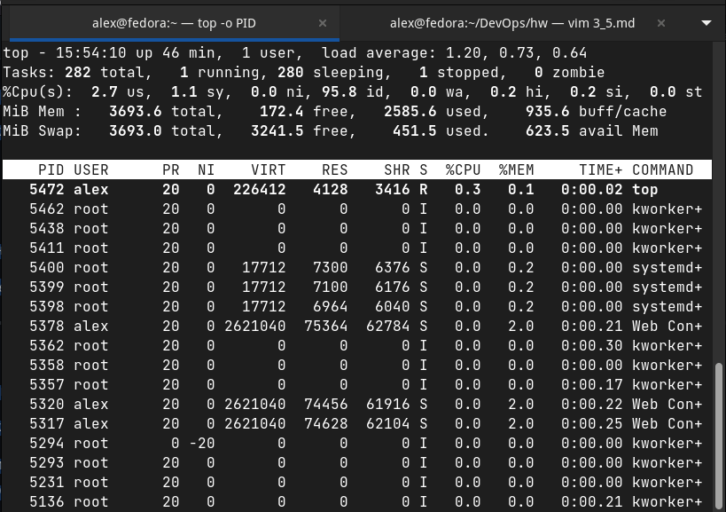

4. 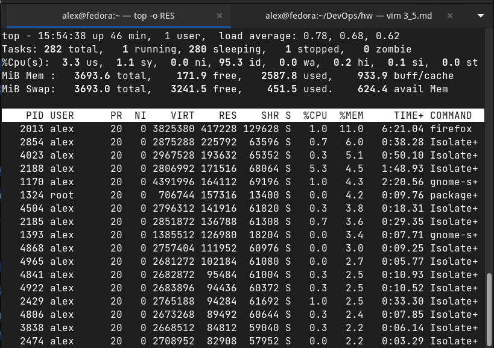

*Менять направление сортировки (от большего к меньшему и наоборот) можно в интерактивном режиме команды* `top` *используя клавишу* __R__

Задание 2.

Выполните проверку системы при помощи команды atop и atopsar.
Выведите сортировку процессов по:
- общей нагрузке (минимум по трем параметрам);
- загруженности HDD or SSD за указанный временной отрезок (10 минут);
- загруженности RAM за указанный временной отрезок (10 минут).
Сконфигурировать файл настроек atop - делать снимок памяти каждые пол часа
Приведите ответ в виде снимков экрана.

1. 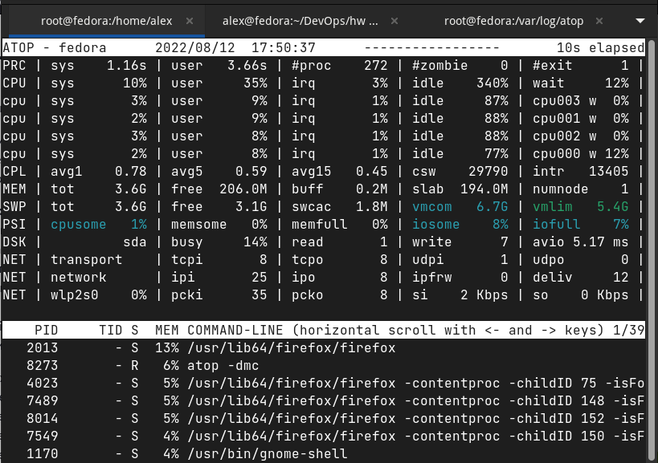

2. 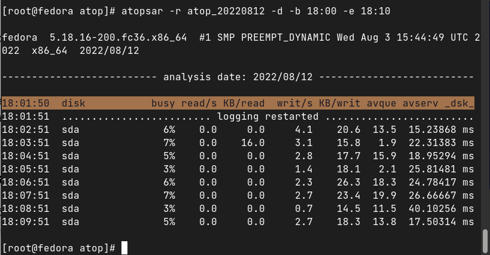

3. 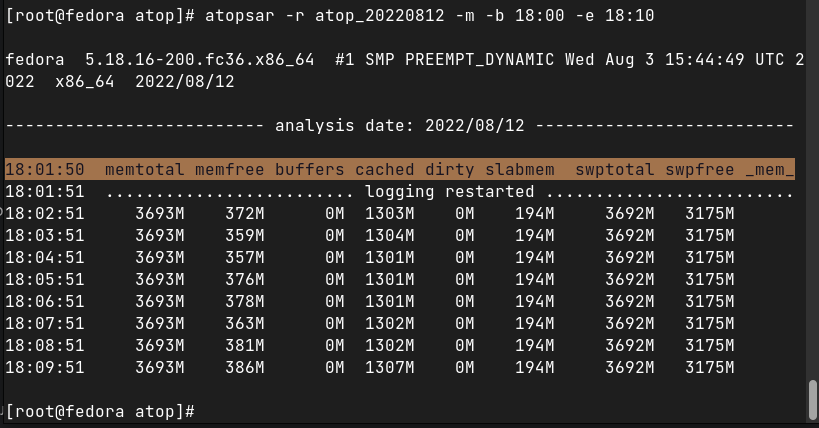

*Изменяем файл конфигурации командой* `vim /etc/sysconfig/atop`
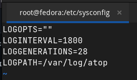

Задание 3.

При помощи команды mpstat и ключа P выведите информацию по:
- определённому процессору;
- всем процессорам.
Приведите ответ в виде снимков экрана.

1. *По определенному (например, первому) процессору* 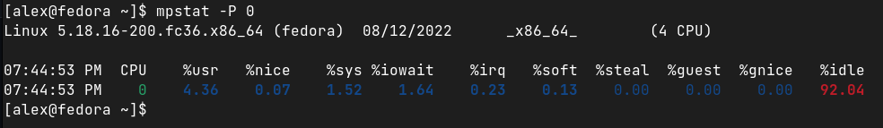

2. *По всем процессорам* 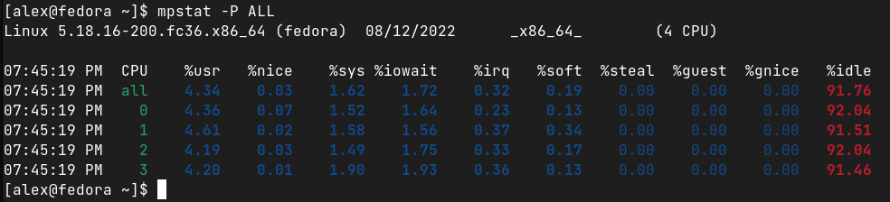

Задание 4.

Выполните проверку системы при помощи команды pidstat.
- Выведите статистику по эффективности на основе имени процесса.
- Выведите полный путь процесса.
Приведите ответ в виде снимков экрана.

1. 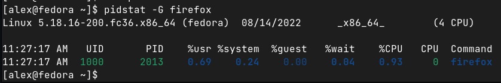

2. 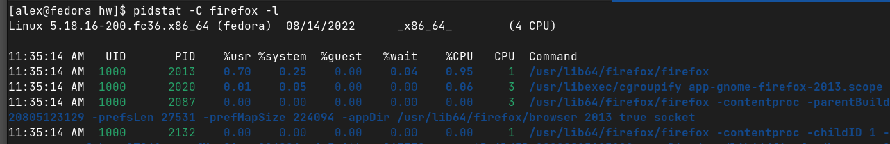

