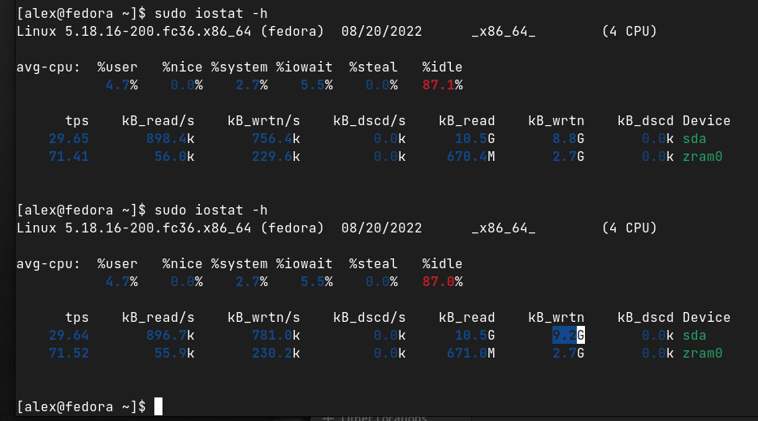
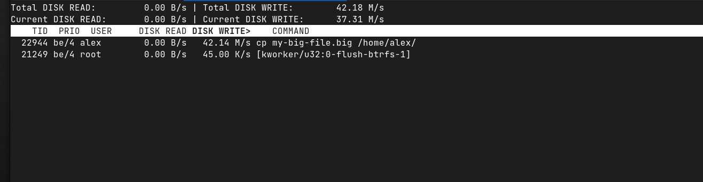
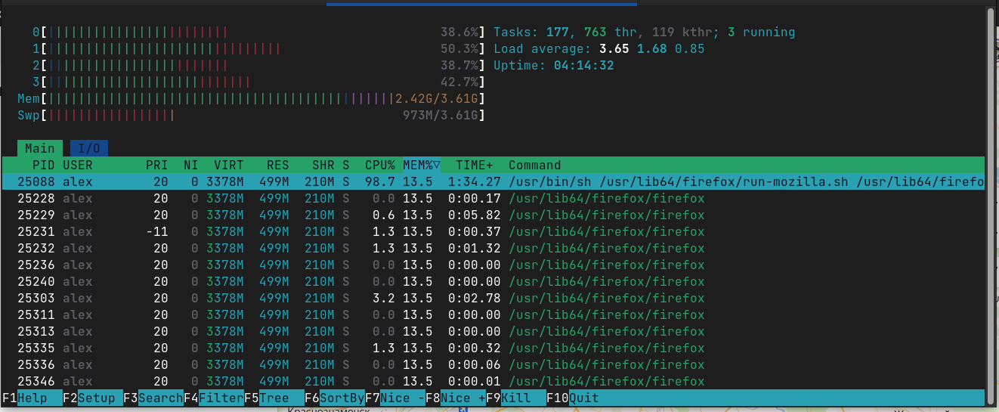
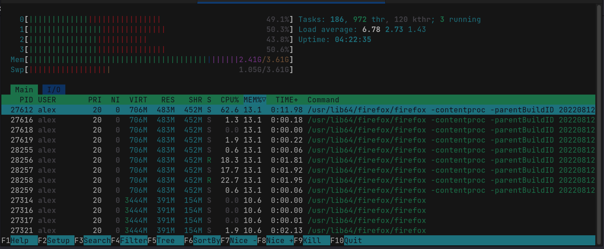
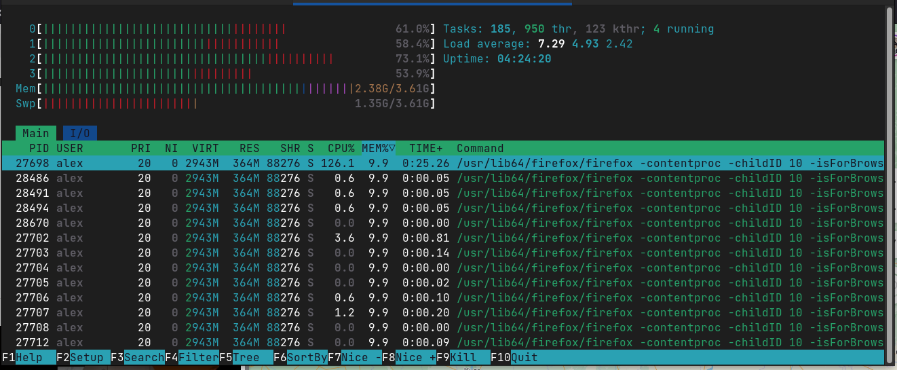

### Задание 1.
Составьте задание через утилиту cron на проверку обьема кэша-обновлений еженедельно.
Кэш-обновлений - это обновления которые остаются после выполнения apt update, apt upgrade.
Приведите ответ в виде команды.

*Ответ для Fedora:*
1. `crontab -e`
2. `0 0 * * 0 dnf clean dbcache`
3. `cronetab -l`
4. `systemctl start crond`

### Задание 2.
- Запустите процесс копирования большого файла (1 Гб) на жесткий диск.
- Запустите команду iostat.
- Запустите iotop.
Какие процессы влияют на данные команды?
Проведите развернутый ответ и приложите снимки экрана.

1. `iostat` Параметр __kb_wrtn__ показывает объем записанный в течение индервала обновления утилиты

2. `iotop` показывает в решиме реального времени процесс (22944 в данном случае) записи и скорость записи

### Задание 3.
Настройте приоритет использования swap в пропорции:
- 30/70;
- 50/50;
- 70/30.
Запустите браузер и нагрузите память.
Проанализируйте результат.
Проведите развернутый ответ и приложите снимки экрана.

*Ответ:*
- `vm.swappiness=30`

- `vm.swappiness=50`

- `vm.swappiness=70`

*С увеличением swappiness увеличивался параметр __Swp__, падала нагрузка на __MEM%__.*

