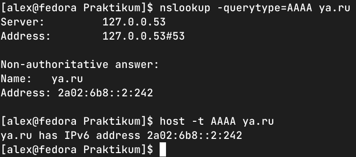

### Задание 1.
Какая нотация используется для записи IPv6-адресов:

- какие и сколько символов?
- какие разделители?

Приведите ответ в свободной форме.

*Ответ: ipv6 отображается как 8 групп, разделенных двоеточием. В каждой группе четырехзначное шестнадцатериичное число.*

### Задание 2.
Какой адрес используется в IPv6 как loopback?
Приведите ответ в свободной форме.

*Ответ: `0:0:0:0:0:0:0:1/128` или `::1/128`*

### Задание 3.
Что такое Unicast, Multicast, Anycast адреса?
Приведите ответ в свободной форме.

*Ответ: Unicast - запрос к одному конкретному хосту. Multicast - обращение к группе хостов. Anycast - обращение к одному рандомному хосту.*

### Задание 4.
Используя любую консольную утилиту в Linux, получите IPv6-адрес для какого либо ресурса.
В качестве ответа приложите скриншот выполнения команды.

*Ответ:*

### Задание 5.
- Как выглядят IPv6-адреса, которые маршрутизируются в интернете?
- Как выглядят локальные IPv6 адреса?
- 
Приведите ответ в свободной форме.
