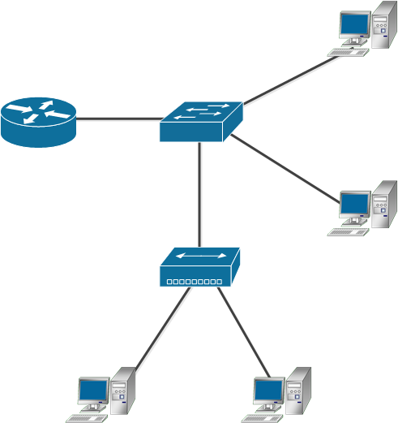
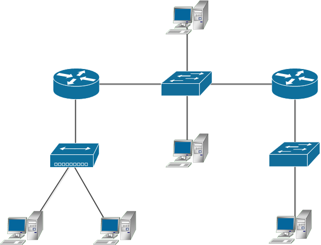

Задание 1.
Адрес канального уровня – MAC адрес – это 6 байт, первые 3 из которых называются OUI – Organizationally Unique Identifier или уникальный идентификатор организации.
Какому производителю принадлежит MAC 38:f9:d3:55:55:79?
Приведите ответ в свободной форме.

*Ответ: Apple, Inc.*

Задание 2.
Какой ключ нужно добавить в tcpdump, чтобы он начал выводить не только заголовки, но и содержимое фреймов в:
- текстовом виде;
- текстовом и шестнадцатиричном виде?
Приведите ответ в свободной форме.

*Ответ: для вывода в текстовом виде `tcpdump -A`. Для вывода в текстовом и шестнадцатиричном виде `tcpdump -XA`*

Задание 3.
- Можно ли изменить MAC-адрес вашего Linux сервера?
- Если да, то какой командой, если нет - почему?
- Для чего может понадобиться изменять MAC-адреса?
Приведите ответ в свободной форме.

*Ответ: можно, командой* `macchanger --mac=XX:XX:XX:XX:XX:XX` *вместо Х проставить MAC адрес. Смена MAC адреса на сервере - атавизм, сейчас не имеет практического применения. Если в ARP запись внести вручную с типом Статический, то срок жизни у такой записи не будет ограничен, в отличие от Динамического типа. На практике в современных локальных сетях бесполезно.*

Задание 4.
- Каким образом можно зафиксировать соответствие IP-MAC и избежать установления этого соответствия по протоколу ARP?
- Каковы положительные и отрицательные стороны такой настройки?
Приведите ответ в свободной форме.

*Ответ: вручную внести запись в таблицу ARP. ПОложительные: никто не сможет провести ARP спуффинг или положить всю локалку, отрицательные - долго прописывать записи в таблице и следить за наполнением таблицы при подключении новых устройств нужно.*

Задание 5.
Какой механизм проверки на наличие ошибок используется в Ethernet?
Приведите ответ в свободной форме.

*Ответ: вычисляется контрольная сумма фрейма, результат записывается в конец фрейма. При приеме контрольная сумма вычисляется еще раз и сравнивается с полученной. Если расхождение - фрейм уничтожается.*

Задание 6.
Как вы думаете, почему серверы в большинстве случаев подключают проводом, а не через WiFi?
Приведите как можно больше доводов в свободной форме.

*Ответ: проводное соединение быстрее, пинг меньше, сигнал wifi подвержен искажениям, если у нас ряды серверов, сигнал вообще может не дойти до роутера. Wifi нужен для мобильности, сервер же никуда носить не нужно.*

Задание 7.
Сколько доменов коллизий изображено на рисунке?
Примечение:
- нижнее устройство - хаб, работающий на 1-м уровне, которые переадресовывает всё, что приходит во все порты сразу, ничего не анализируя;
- в центре - коммутатор, работает на 2-м уровне.
- круглое устройство - маршрутизатор, работает на 3-м уровне модели OSI.

*Ответ: 4*

Задание 8.
Сколько широковещательных доменов изображено на рисунке?
Примечение: круглое устройство - маршрутизатор, работает на 3-м уровне модели OSI.

*Ответ: 3*

