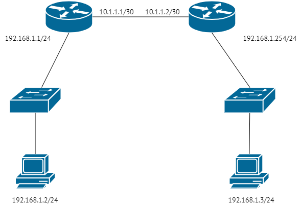

### Задание 1.
- Cколько доступно для назначения хостам адресов в подсети /25?
- А в подсети с маской 255.248.0.0.
Примечение: постарайтесь потренироваться в ручных вычислениях чтобы немного набить руку, не пользоваться калькулятором сразу.
Приведите ответ в свободной форме.

*Ответ:*
*/25 или 1111111.11111111.11111111.10000000 означает, что количество ip-адресов в этой подсети будет 2^7 степени или 128. Хостам можно назначить только 126, т.к. один адрес на адрес сети, еще один - широковещательный*
*225.248.0.0 или /21 означает, что количество ip-адресов в этой подсети будет 2^11 степени или 2048. Хостам можно назначить только 2046*

### Задание 2.
В какой подсети больше адресов, в /23 или /24?
Приведите ответ в свободной форме.

*Ответ: в подсети /23 2^9 или 512, в подсети /24 2^10 или 256.*

### Задание 3.
- Получится ли разделить диапазон 10.0.0.0/8 на 128 подсетей по 131070 адресов в каждой?
- Какая маска будет у таких подсетей?
Приведите ответ в свободной форме.

*Ответ: получится. `10.0.0.0/8` - это 2^24 адресов, т.е. 16_777_216 (для хостов 16_777_214). 128 подсетей х 131_070 адресов + 128 х 2 (занятые адреса) = 16_777_216*
*Подберем маску: узлов в сети 131_020 это 2^17, т.е. 32 - 17 = 15. Маска /15*

### Задание 4.
С помощью дополнительных материалов укажите минимальную маску для подсети, в которой находится:
- 12 хостов.
- 39 хостов.
- 2 хоста.
- 4 хоста.
Примечение: потренируйтесь указывать маску как в формате 255.255.255.0, так и в формате /24.
Приведите ответ в свободной форме.

*Ответ:*
|Кол-во хостов|Маска в десятеричной форме|Сокращенная форма|
|-------------|--------------------------|-----------------|
| 12 хостов | 255.255.255.240 | /28 |
| 39 хостов | 255.255.255.192 | /26 |
|  2 хоста  | 255.255.255.254 | /31 |
|  4 хоста  | 255.255.255.252 | /30 |

### Задание 5.
Используя свои знания про L2 и L3, поразмышляйте:
- получится ли отправить пакет с компьютера 192.168.1.2 на компьютер 192.168.1.3 если они подключены согласно приведённой ниже схеме?

Дайте максимально развернутый ответ.

### Задание 6.
Используя свои знания про маску подсети, L2 и L3, ответьте на вопросы:
- смогут ли общаться между собой компьютеры 192.168.1.25/24 и 192.168.1.2/30?
- сможет ли выйти в интернет компьютер 192.168.1.25/24, если шлюзом прописан маршрутизатор 192.168.1.1?
- сможет ли выйти в интернет компьютер 192.168.1.2/30, если шлюзом прописан маршрутизатор 192.168.1.1?

Дайте максимально развернутый ответ.

*Ответ*
- `192.168.1.25/24` *сможет пингануть* `192.168.1.2/30`, *а вот обратно уже не получится - маска /30 не позволит второму хосту увидеть адрес* `192.168.1.25`.*
- *Сможет, т.к. позволяет маска сети. /24 - это 256 адресов включая адрес маршрутизатора.*
- *Сможет, т.к. позволяет маска сети. /30 - это 4 адреса включая адрес маршрутизатора

### Задание 7.
Мы купили новый роутер, в инструкции написано, что у него статический адрес 10.0.0.1/24.
На нашем компьютере прописан адрес 192.168.1.25/24, шлюз по-умолчанию 192.168.1.1.
- откроется ли окно для настройки роутера если ввести адрес 10.0.0.1 в браузер?
- почему?
- что рекомендуется делать в таком случае?

Приведите ответ в свободной форме.

*Ответ:*
- Не откроется
- Адрес `10.0.0.1` не принадлежит сети `192.168.1.25`
- Прописать ip хоста как `10.0.0.2`, маску подсети /24. Основной шлюз будет `10.0.0.1`

### Задание 8.
Выберите корректные IP-адреса

|  № | 	IP             | 
|----|-----------------|
| 1. |	192.168.1.1    |
| 2. |	273.566.48.1   |
| 3. |	90.90.10.1     |
| 4. |	192.168.3      |
| 5. |	0.165.14.5     |
| 6. |	1.1.1.1        |

В ответе приведите номера корректных пунктов. При желании напишите, что не так у остальных.

*Ответ:*
|  № |  IP             | Комментарий |
|----|-----------------|-------------|
| 1. |  192.168.1.1    | OK |
| 2. |  273.566.48.1   | первые 2 октета больше 255 |
| 3. |  90.90.10.1     | ОК |
| 4. |  192.168.3      | не хватает октета |
| 5. |  0.165.14.5     | OK |
| 6. |  1.1.1.1        | OK |

