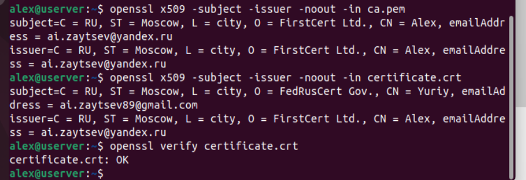

### Задание 1.
Какие порты используются протоколами:
- Telnet;
- SSH;
- FTP;
- SNMP;
Приведите ответ в виде списка портов.

| Протокол | Порт |
|----------|------|
| Telnet   | 23   |
| SSH      | 22   |
| FTP      | 21 для команд, 20 для данных, 49152-65534 динамически |
| SNMP     | 161, 162 |

### Задание 2.
Какой по счету уровень модели OSI называется прикладным (application layer)?
Зашифруйте ответ с помощью ключа: {5, 21}.

*Ответ: 7*

### Задание 3.
Создайте свой корневой сертификат, добавьте его в систему.
Затем подпишите им свой сертификат.
В качестве ответа приложите снимки экрана с выводом информации о сертификатах и результатом верификации:

`openssl x509 -subject -issuer -noout -in ca.pem`

`openssl x509 -subject -issuer -noout -in certificate.crt`

`openssl verify certificate.crt`

*Ответ:*

