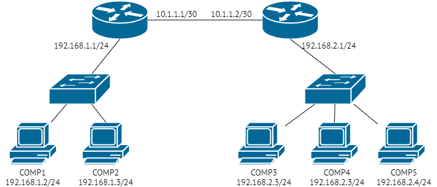

### Задание 1.
- Укажите путь к файлам логов веб-сервера Nginx.
- Где находится конфигурационный файл, в котором можно посмотреть / поменять эти пути?
- Какой командой можно воспользоваться для просмотра файла журнала в режиме реального времени? Попробуйте найти сами, либо воспользуйтесь [ссылкой](https://andreyex.ru/operacionnaya-sistema-linux/nastrojka-zhurnala-oshibok-i-dostupa-nginx/).
Приведите ответ в свободной форме.

*Ответ:*
*Путь  к файлам логов:* `/var/log/nginx`
*Конфигурационный файл:* `/etc/nginx/nginx.conf`
*Команда для просмотра файла журналов по мере его обновления:* `tail -f  access.log`  & `tail -f  error.log`

### Задание 2.
Познакомьтесь со схемой сети.

- COMP1 не может обменяться данными с COMP4. Какую последовательность действий вы выберете для того, чтобы локализовать проблему?
- Возможно ли, чтобы при выполнении ping 192.168.1.2 с компьютера COMP5, ping прошёл, а подключение по HTTP с COMP5 на COMP1 не проходило бы? Поясните свой ответ максимально детально.
- COMP5 отправляет ping на COMP1 и COMP2, при этом COMP1 на ping отвечает, а COMP2 - нет.
Приведите максимальное количество причин. Самую простую, но нередко встречающуюся - «У COMP2 выдернули кабель питания» - я уже ответил за вас.
- COMP1 пингует только адреса из подсети 192.168.1.0/24 (COMP2 и 192.168.1.1), больше никакие адреса не пингуются. С чем это может быть связано?
Приведите ответ в свободной форме.
