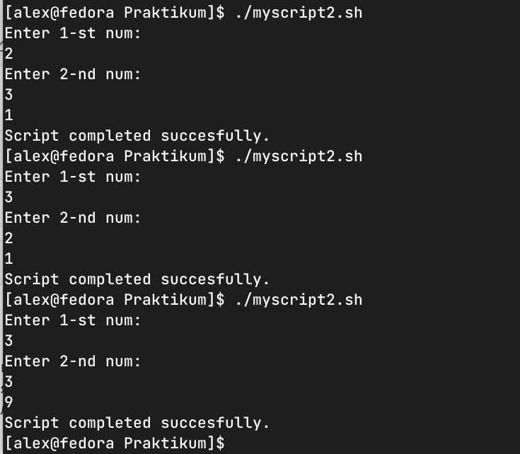
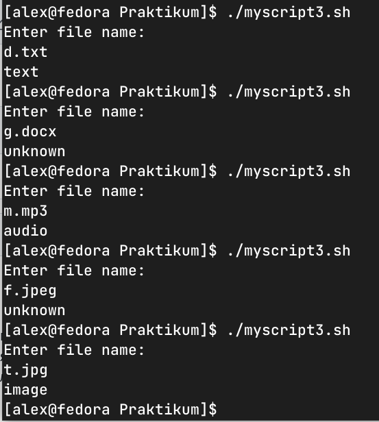

### Задание 1.
Напишите скрипт, который при запуске спрашивает у пользователя путь до директории и создает ее при условии, что ее еще не существует. Если директория существует – пользователю выводится сообщение, что директория существует. Скрипт должен принимать абсолютный путь до директории, например /tmp/testdir или /home/user/testdir
Пришлите получившийся код и скриншот, показывающий работу скрипта в качестве ответа.

*Ответ*
```
#!/bin/bash
echo "Enter absolute path: "
read folderpath
if [[ $folderpath == /* ]];
  then
    if [[ -d "$folderpath" ]];
      then
        echo "Folder $folderpath already exists."
        exit 1
    else
      mkdir $folderpath
      echo "Folder $folderpath created"
      exit 0
    fi
else
  echo "Invalid path: should start with '/'. "
  exit 1
fi
```


### Задание 2.
Напишите скрипт:

1. При запуске скрипта пользователь вводит два числа.
2. Необходимо вычесть из большего числа меньшее и вывести результат в консоль.
3. Если числа равны – умножить их друг на друга (или возвести в квадрат одно из чисел) и вывести результат в консоль.

Пришлите получившийся код и скриншот, показывающий работу скрипта в качестве ответа.

*Ответ*
```
echo "Enter 1-st num:"
read num1
echo "Enter 2-nd num:"
read num2
if [[ "$num1" != "$num2" ]]; then
  if [[ "$num1" > "$num2" ]]; then
    echo "$(($num1-$num2))"
  else
    echo "$(($num2-$num1))"
  fi
else
  echo "$(($num1*$num2))"
fi
echo "Script completed succesfully."
```



### Задание 3.
Напишите скрипт с использованием оператора case:

1. При запуске скрипта пользователь вводит в консоль имя файла с расширением, например 123.jpg или track.mp3.
2. Необходимо сообщить пользователю тип файла.
- Если jpg, gif или png – вывести слово «image»
- Если mp3 или wav – вывести слово «audio»
- Если txt или doc – вывести слово «text»
- Если формат не подходит под заданные выше – написать «unknown»

Пришлите получившийся код и скриншот, показывающий работу скрипта в качестве ответа.

*Ответ*

```
#!/bin/bash
echo "Enter file name:"
read filename
case "$filename" in (*.jpg|*.gif|*.png)
    echo "image"
    ;;
  *.mp3|*.wav)
    echo "audio"
    ;;
  *.doc|*.txt)
    echo "text"
    ;;
   *)
    echo "unknown"
    ;;
esac
```


