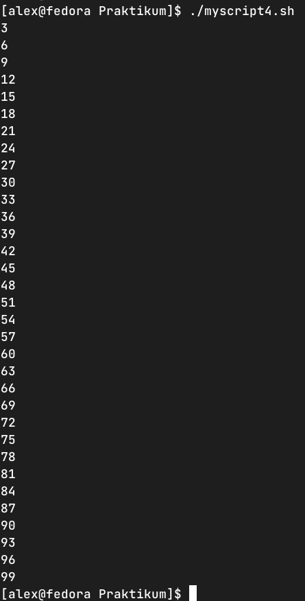
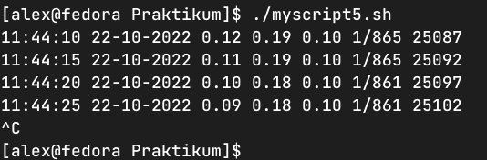
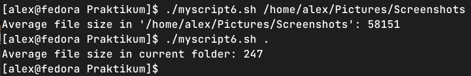

### Задание 1.
Напишите скрипт, который выводит на экран все числа от 1 до 100, которые делятся на 3.

Пришлите получившийся код и скриншот, показывающий работу скрипта в качестве ответа.

*Ответ*

```
#!/bin/bash
for ((i=1;i<101;i++))
  do
    if [[ $((i%3)) -eq 0 ]]; then
      echo $i
    fi
  done
```



### Задание 2.
Напишите скрипт, который каждые 5 секунд будет выводить на экран текущее время и содержимое файла /proc/loadavg.

Пришлите получившийся код и скриншот, показывающий работу скрипта в качестве ответа.

*Ответ*

```
#!/bin/bash
while true; do
  echo $(date "+%H:%M:%S %d-%m-%Y") | tr "\n" " " && cat /proc/loadavg
  sleep 5
done
```




### Задание 3.
Напишите функцию для подсчета среднего размера файла в директории.

- путь к директории должен передаваться параметром, например avgfile /home/username;
- функция должна проверять, что такая директория существует, подсчитывать и выводить на экран средний размер файла в ней;
- при подсчете не нужно учитывать поддиректории и символьные ссылки, считать только средний размер файлов в заданной директории.

*Ответ*

```
#!/bin/bash
avgfile () {
  if [ -d $1 ]; then
    sumfilesize=0
    countfiles=0
    for item in $1/*; do 
	if [ -f "$item" ] ; then
	  ((countfiles++))
	  ((sumfilesize+=$(stat -c "%s" "$item")))
        fi  		
      done
    if [ $countfiles -eq 0 ]; then
      echo "No files detected in directory $1"
      exit 1
    else
      avg=$((sumfilesize/countfiles))
      if [ "$1" = "." ]; then
        echo "Average file size in current folder: $avg"
      else
	echo "Average file size in '$1': $avg"
      fi
    fi
  else
    echo "Folder $1 does not exist"
    exit 1
  fi
}

avgfile $1
```


