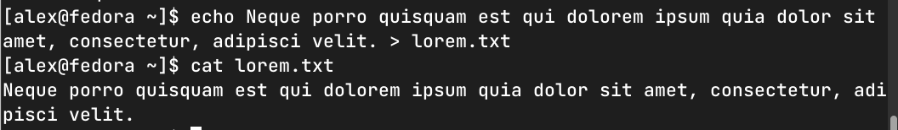
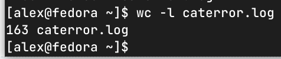
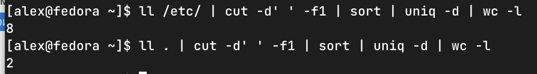

### Задание 1.
- Создайте файл с наполнением, используя несколько способов;
- Используйте изученные на занятии текстовые редакторы для наполнения файлов произвольными данными.
Приведите ответ в свободной форме.

*Ответ:*

### Задание 2.
- Выведите с помощью cat содержимое всех файлов в директории `/etc (cat /etc/*)`;
- Направьте ошибки в отдельный файл в вашей домашней директории.
Сколько объектов не удалось прочесть?

Пришлите получившийся скриншот вывода.

*Ответ: 163*

### Задание 3.
- Используйте команду `cut` на вывод длинного списка каталога, чтобы отобразить только права доступа к файлам;
- Отправьте в конвейере этот вывод на `sort` и `uniq`, чтобы отфильтровать все повторяющиеся строки;
- С помощью `wc` подсчитайте различные типы разрешений в этом каталоге.
- Уберите из подсчета строку `total`.
Пришлите получившийся скриншот вывода.

*Ответ:* `ll /etc/ | cut -d' ' -f1 | sort | uniq -d | wc -l`

